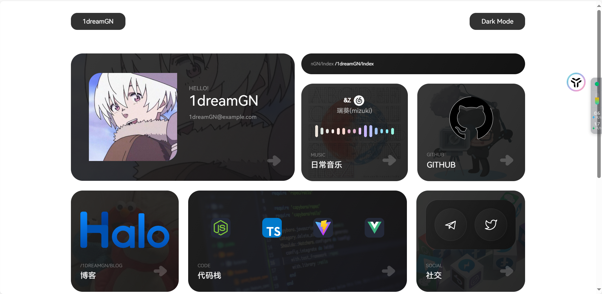
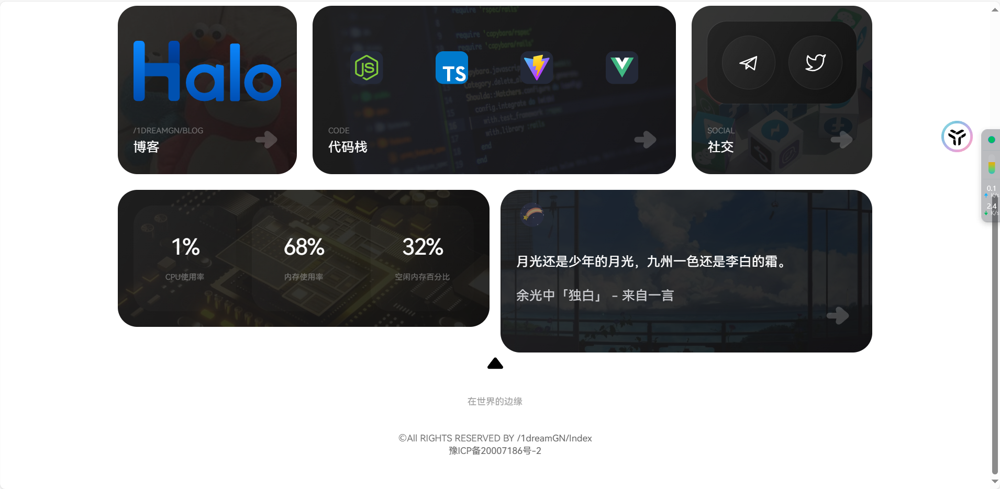
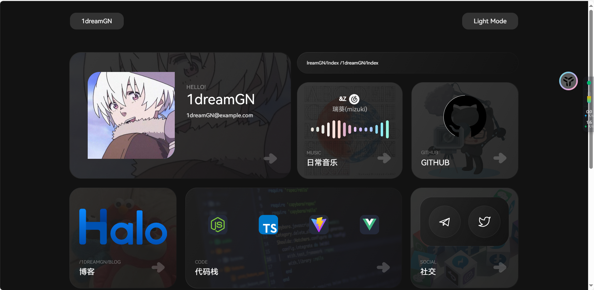
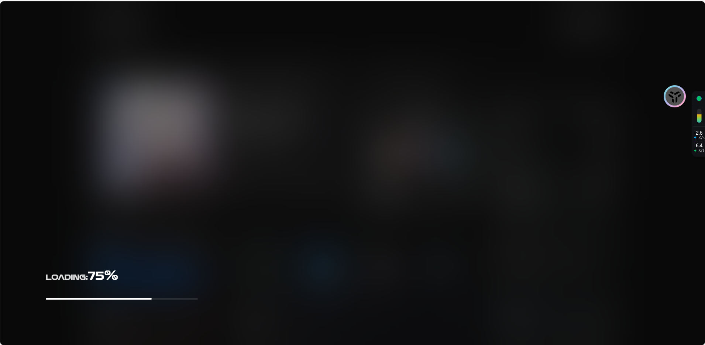

# gowninng.cn_vue

## 版本更新历史

### v1.2.0 (2024-03)
- 🔐 后端更新-java11可运行
  - 优化登录功能
    - 实现基于JWT的身份验证
    - 添加登录状态持久化
    - 优化登录界面交互体验
  - 改进后端接口
    - 重构API接口结构，提高代码复用性
    - 优化数据库查询性能
    - 添加接口访问限制
  - 提升系统安全性
    - 实现请求加密传输
    - 增加XSS防护
    - 加强密码安全策略

### v1.1.0 (2024-03)
- 🌟 新特性
  - 添加一言功能
    - 集成一言API，实现随机名言展示
    - 支持手动刷新一言内容
    - 优化一言展示样式
  - 新增服务器状态监控功能
    - 实时监控服务器CPU使用率
    - 显示内存占用情况
    - 网络状态监测
  - 优化页面样式
    - 改进响应式布局
    - 优化动画效果
    - 提升整体用户体验

### v1.0.0 (初始版本)
- 🎉 项目初始化
  - 基于Vue 3框架重构
    - 使用Composition API
    - 集成TypeScript
    - 状态管理使用Pinia
  - 使用Vite作为构建工具
    - 快速的开发服务器
    - 优化的构建配置
  - TypeScript支持
    - 完整的类型定义
    - 更好的开发体验
  - 现代化的UI设计
    - 响应式布局
    - 动画过渡效果
    - 深色模式支持

## 项目预览






## 项目说明
将某源码（忘了叫啥，没找到模板名）改成了vue版本，并大量改动部分样式，添加一言，服务器状态等，集成了多个实用功能，包括一言展示、服务器状态监控等。**登录是在左上角的按钮，和黑暗模式平行的那个。**

### 技术栈

- 前端框架：Vue 3
- 构建工具：Vite
- 语言：TypeScript
- 状态管理：Pinia
- 路由：Vue Router
- HTTP客户端：Axios
- 动画库：AOS
- 开发工具：ESLint, Prettier
- 后台：Springboot

### 项目结构

```
├── src/                # 源代码目录
│   ├── assets/         # 静态资源
│   ├── components/     # 组件
│   ├── config/         # 配置文件
│   ├── router/         # 路由配置
│   ├── stores/         # 状态管理
│   ├── types/          # 类型定义
│   ├── utils/          # 工具函数
│   └── views/          # 页面视图
├── server/             # 后端服务
└── public/             # 公共资源
```

## 部署说明

### 服务器状态监控部署

**前端配置文件在 \src\stores\globalStore.ts
后端配置文件在 \server\src\main\resources\application.properties
后端打包成jar后，然后在jar所在的目录创建config文件夹，将后端的配置文件application.properties放到config文件夹中。**


服务器状态监控功能现已集成到后端项目中，无需额外的Node.js服务。之前的nodejs代码还在保留。

~~node版本服务器状态js在src/utils/server.js 打包项目的时候要单独拉出来，放到项目根目录下。~~

<<<<<<< HEAD
~~将server.js 和package.json 放到项目根目录 package.json内容为~~
=======
node版本服务器状态js在src/utils/server.js 打包项目的时候要单独拉出来 


将server.js 和package.json 放到项目根目录 package.json内容为
>>>>>>> 25468f19c8f0c3ee4058ba988360b7da67db3689

```
{
  "name": "gowninng_vue_server",
  "version": "1.0.0",
  "description": "",
  "type": "module",
  "main": "server.js",
  "scripts": {
    "test": "echo \"Error: no test specified\" && exit 1",
    "start": "node server.js"
  },
  "keywords": [],
  "author": "",
  "license": "ISC",
  "dependencies": {
    "nodemon": "^3.1.7"
  }
}
```

~~然后npm install 安装模块 再npm run start启动服务器状态插件~~

#以下是Vue官方介绍的启动方式

这个模板应该帮助你开始使用 Vue 3 和 Vite 进行开发。


### 开发环境设置

1. 安装依赖：
```sh
npm install
```

2. 启动开发服务器：
```sh
npm run dev
```

3. 构建生产版本：
```sh
npm run build
```

### 其他命令

- 运行单元测试：`npm run test:unit`
- 运行端到端测试：`npm run test:e2e`
- 代码格式化：`npm run format`
- 代码检查：`npm run lint`

## 推荐的IDE设置

- [VSCode](https://code.visualstudio.com/) + [Volar](https://marketplace.visualstudio.com/items?itemName=Vue.volar)（并禁用Vetur）
- 启用TypeScript支持
- 配置ESLint和Prettier插件

## 配置说明

- 环境变量配置在 `.env` 文件中
- Vite配置在 `vite.config.ts` 中
- TypeScript配置在 `tsconfig.json` 中
- ESLint配置在 `eslint.config.js` 中
- Prettier配置在 `.prettierrc.json` 中

## 许可证

本项目使用 [MIT](LICENSE) 许可证
